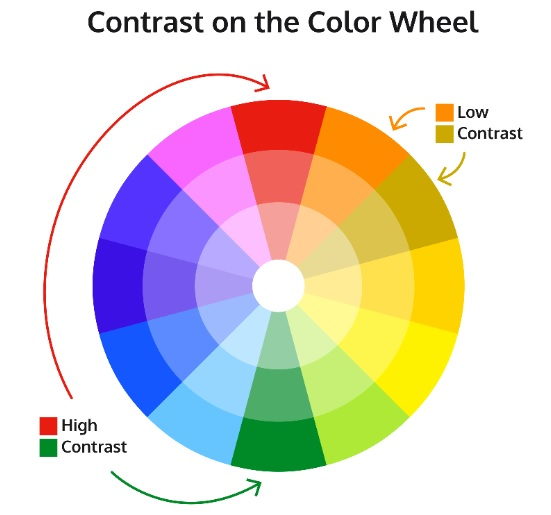
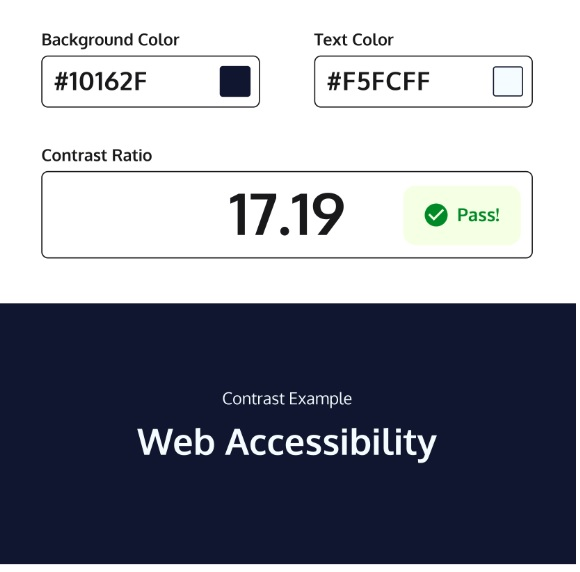

[This is the link to the lesson](https://www.codecademy.com/courses/learn-css-accessibility/lessons/learn-intermediate-css-accessibility/exercises/visual-readability-color)

# ACCESSIBILITY

## Visual Readability: Color

> Color plays a major role in a user’s ability to read the information located on a page. If [colors](https://www.codecademy.com/resources/docs/css/colors) lack sufficient contrast, they can become hard to distinguish from one another. Oftentimes, text can become lost in the background color, which prevents users, especially those with vision impairments, from reading it. The solution to this is to provide adequate contrast between foreground and background elements. To understand contrast, we must first understand where it comes from: the color wheel.
> 

> Two colors are contrasting when they are from different segments of the color wheel. Thus, the farther apart the segments, the higher the contrast between the two colors. The difference between the two colors is known as the contrast ratio and a minimum contrast ratio must be met in order to adhere to accessibility standards. The minimum contrast ratio denotes how high the contrast is between the text of certain sizes and width on a specific background. This ratio can range from 1:1, where both compared colors are the same, to 21:1, where the two colors are black and white.

